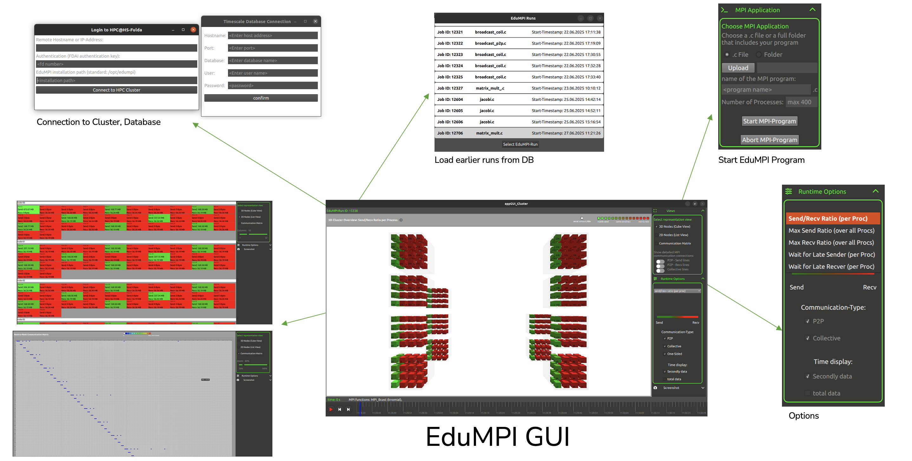

# EduMPI GUI – Frontend 

**EduMPI GUI** is the graphical interface for [EduMPI](https://github.com/AnnaLena77/EduMPI),  
an Open MPI fork with integrated near-real-time performance measurement.  

The GUI provides students and educators with a **simple, intuitive way to run MPI applications on HPC clusters**  
and to **visualize communication patterns, performance metrics, and wait states** without prior knowledge of SSH, SLURM, or traditional profiling tools.

---

## ✨ Key Features

- **Simplified Cluster Access**
  - No SSH or SLURM scripting required  
  - Direct login via GUI  
  - Automatic file upload and job submission  

- **Job Management**
  - Select MPI executable and number of processes  
  - Start, monitor, and abort jobs interactively  
  - View job status in real-time  

- **Integrated Visualization**
  - **2D process view**: communication, bytes sent/received, wait times  
  - **3D cluster view**: processes as colored cubes on their physical nodes  
  - **Communication matrix**: direct process-to-process message analysis  
  - Interactive timeline navigation (per-second or interval-based)  

- **Educational Focus**
  - Helps students understand MPI behavior through visual cues  
  - Removes barriers of complex HPC toolchains  
  - Designed for classroom and lab exercises  

---

## ⚙️ Architecture

The GUI acts as the **frontend client** in the EduMPI ecosystem:

1. Students launch the GUI (AppImage or local build)  
2. Login to the HPC cluster with provided credentials  
3. Select an MPI program and execution parameters  
4. EduMPI (cluster-side) executes the job and writes performance data to **TimescaleDB**  
5. The GUI queries aggregated data in near-real-time and visualizes results  


---

## 🖥️ Screenshots


  

---

## 🚀 Installation

### Option 1: Download Prebuilt AppImage (Recommended)
1. Download the [EduMPI GUI AppImage](https://github.com/AnnaLena77/EduMPI_GUI_Download)  
2. Make it executable:  
   ```bash
   chmod +x EduMPI_GUI-x86_64.AppImage
   ```
3. run it:
   ```bash
    ./EduMPI_GUI-x86_64.AppImage
    ```

### Option 2: Build from Source
1. Clone the repository:
     ```bash
    git clone git@github.com:AnnaLena77/EduMPI_GUI.git
    cd EduMPI_GUI
    ```
2. Install dependencies (Qt ≥ 6 recommended)
3. Build using CMake
4. Run the resulting binary

## 📚 References

EduMPI is described in:

- Roth, Anna-Lena; Süß, Tim (2023): *Performance Analysis Tools for MPI Applications and their Use in Programming Education*. In Companion of the 2023 ACM/SPEC International Conference on Performance Engineering (ICPE '23 Companion). Association for Computing Machinery, New York, NY, USA, 361–368. 
DOI: [10.1145/3578245.3584358](https://doi.org/10.1145/3578245.3584358) 
- Roth, Anna-Lena; James, David; Kuhn, Michael; Konert, Johannes (2024): *Enhancing Parallel Programming Education with High-Performance Clusters Utilizing Performance Analysis*. Proceedings of DELFI 2024. DOI: 10.18420/delfi2024_42. Gesellschaft für Informatik e.V. 
DOI: [10.18420/delfi2024_42](https://doi.org/10.18420/delfi2024_42)
- Roth, Anna-Lena; James, David; Kuhn, Michael (2025): *EduMPI – Simplifying the Use of High-Performance Clusters and Focusing Performance Analysis in Parallel Programming Education*. PARS-Mitteilungen: Vol. 37. Gesellschaft für Informatik e.V., Fachgruppe PARS. ISSN: 0177-0454[LINK](https://dl.gi.de/server/api/core/bitstreams/5ee764b8-731a-4b8e-aca4-28cb0538fd7b/content)
- Roth, Anna-Lena; James, David; Kuhn, Michael; Frisch, Dustin (2025): *Making MPI Collective Operations Visible: Understanding Their Utility and Algorithmic insights*. In: Nagel, W.E., Goehringer, D., Diniz, P.C. (eds) Euro-Par 2025: Parallel Processing. Euro-Par 2025. Lecture Notes in Computer Science, vol 15900. Springer, Cham. 
DOI: [10.1007/978-3-031-99854-6_5](https://doi.org/10.1007/978-3-031-99854-6_5)

---

## 🔮 Future Work

- Improve ring buffer adaptivity to avoid overflow in micro-benchmarks  
- Extend support for additional MPI language bindings beyond C  
- Portable integration as an **independent framework** instead of Open MPI fork  
- Additional visualization dashboards (historical runs, anomaly detection)  

---


